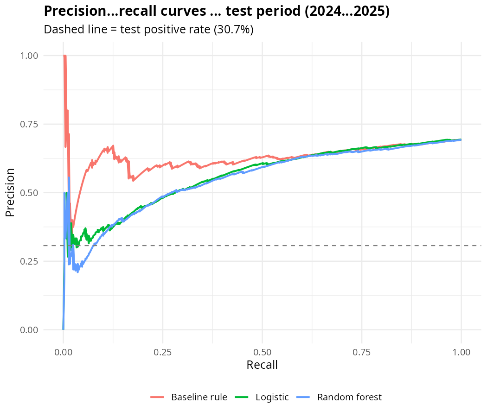
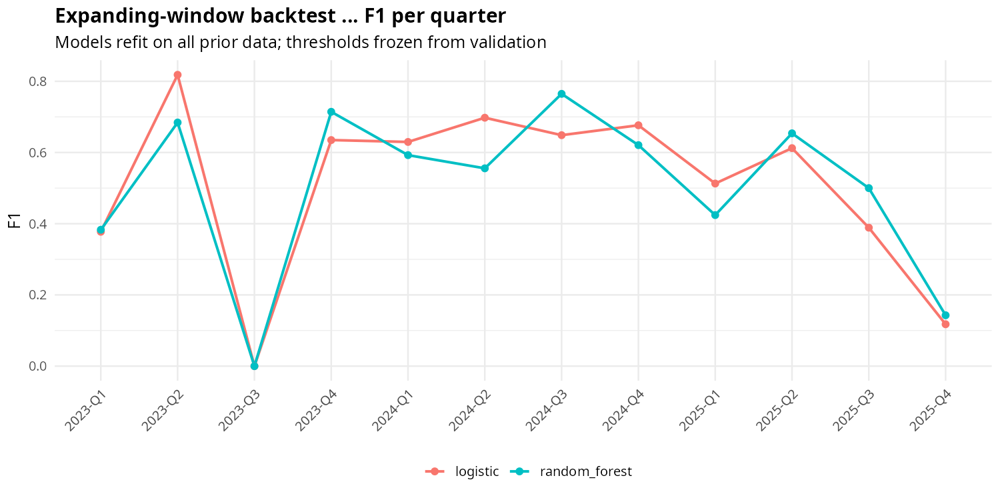

# Financial Market Risk Prediction — High-Volatility Forecasting (R)

Predict whether the **next five trading days** will be a high-volatility period,
using only information available as of the current trading date. Built end-to-end
in **R** (RStudio project): inspection → EDA → past-only feature engineering →
rigorous target definition → chronological validation → logistic regression vs
random forest → expanding-window backtest → R Markdown report + Shiny dashboard.

> **Not investment advice / not a trading recommendation.** This is a market-risk
> classification exercise on **synthetic** data.

## Project structure

```
financial-market-risk/
├── financial-market-risk.Rproj   # RStudio project file — double-click to open
├── run_all.R                     # runs the full pipeline + renders the report
├── data/
│   ├── market_risk_daily.csv     # synthetic daily market series (2020–2025)
│   └── modeling_table.csv/.rds  # analysis-ready table (built by R/03)
├── R/
│   ├── utils.R                   # shared helpers (metrics, thresholds, theme)
│   ├── 01_inspect.R              # data-quality inspection
│   ├── 02_eda.R                  # exploratory plots → figures/eda/
│   ├── 03_features_target.R      # rigorous target + past-only features
│   ├── 04_train_evaluate.R       # logistic vs RF, threshold tuning, metrics
│   └── 05_backtest.R             # expanding-window quarterly backtest
├── figures/                      # eda/ and model/ plots (PNG)
├── models/                       # fitted models (.rds), thresholds, meta
├── outputs/                      # metrics, confusion matrices, backtest CSVs
├── report/
│   ├── market_risk_report.Rmd    # concise report source
│   └── market_risk_report.html   # rendered report
├── shiny/app.R                   # dashboard: current risk, performance, stability
└── README.md
```

## How to run (RStudio)

1. Open `financial-market-risk.Rproj`.
2. Install the required packages (once):
   ```r
   install.packages(c("tidyverse", "lubridate", "zoo", "ranger",
                      "pROC", "PRROC", "rmarkdown", "knitr", "shiny", "tidyr"))
   ```
3. Run the whole pipeline from the project root:
   ```r
   source("run_all.R")
   ```
   Scripts are numbered — you can also run them one at a time in order.
4. Read the report: open `report/market_risk_report.html` in a browser.
5. Launch the dashboard:
   ```r
   shiny::runApp("shiny")
   ```

Tested on R 4.3.3 (Ubuntu 24.04). All randomness is seeded (`set.seed(42)`);
splits and thresholds are date-defined, so reruns are deterministic.

## Method in brief

- **Target (rigorous):** future 5-day realized volatility (sd of returns over
  *t+1…t+5*); "high" = ≥ 75th percentile estimated on the **training period only**,
  then the frozen threshold is applied to validation/test. The supplied
  `high_volatility_next_5d` column is treated as a practice label (agreement ≈ 90%+).
- **Features (16, all past-only):** 5 lagged returns; trailing 5/20-day mean
  return; trailing 10-day return sd; supplied trailing 5/20-day vol columns
  (**verified** trailing by recomputation — safe, no leakage); log volume and
  volume-vs-20d-average; 5-day high–low range; distance from 20-day MA; 60-day
  drawdown; 14-day RSI (Wilder).
- **Validation:** chronological split — train 2020–2022, validation 2023
  (threshold tuning: max F1), test 2024–2025. Plus an expanding-window quarterly
  backtest (2023-Q1 → 2025-Q4) with frozen thresholds.
- **Models:** logistic regression (standardized features) vs random forest
  (`ranger`, 500 trees, probability mode) vs a naive rule baseline (predict
  high-vol when trailing 20-day vol exceeds its training 75th percentile).
- **Metrics:** precision, recall, F1, ROC-AUC, PR-AUC, confusion matrices.

## Results at a glance




## Key results (test period, 2024–2025)

See `report/market_risk_report.html` and `outputs/metrics_val_test.csv` for the
full tables.

| Model | F1 | ROC-AUC | PR-AUC |
|---|---|---:|---:|
| Logistic regression | 0.56 | 0.71 | 0.56 |
| Random forest | 0.56 | 0.73 | 0.55 |
| Naive trailing-vol rule | 0.39 | 0.62 | 0.63 |

Headline pattern: with validation-tuned thresholds, both models beat the naive
rule as *classifiers* (F1 0.56 vs 0.39). But the naive rule is the better
*ranker* (PR-AUC 0.63) — volatility persistence means the highest trailing-vol
days are very likely to stay volatile. The quarterly backtest shows both
models dip in calm regimes (e.g. 2023-Q3 had only 3 positives in 65 days) — a
production setup would need periodic refits and monitoring, not a train-once
model.

## Limitations

- Synthetic data — nothing here transfers to real markets.
- Single series; no macro or cross-sectional features.
- The 75th-percentile "high-vol" cutoff is defensible but arbitrary.
- False alarms vs misses are discussed qualitatively; a real deployment needs a
  cost matrix from the risk desk.
- Predicts volatility, not returns or direction.
