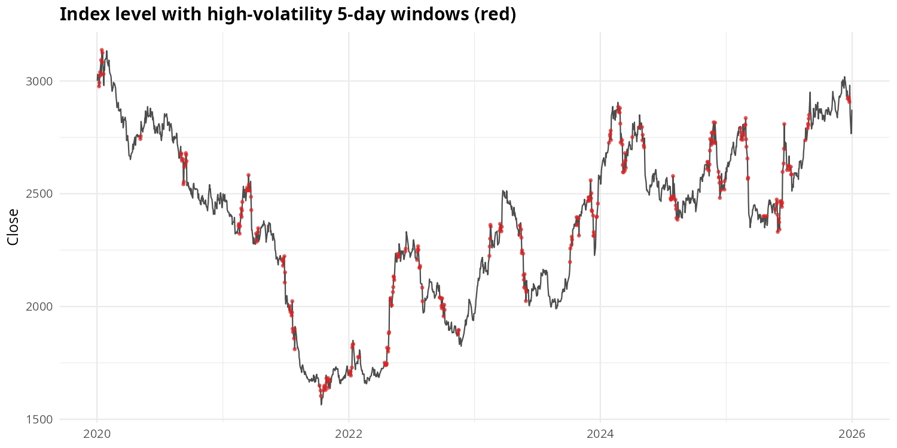
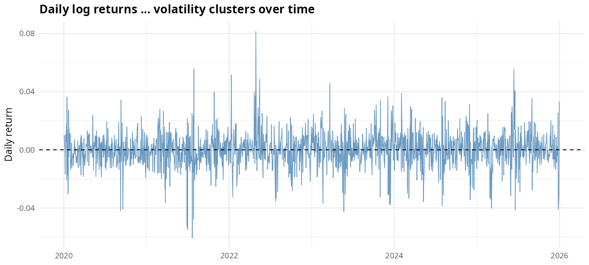
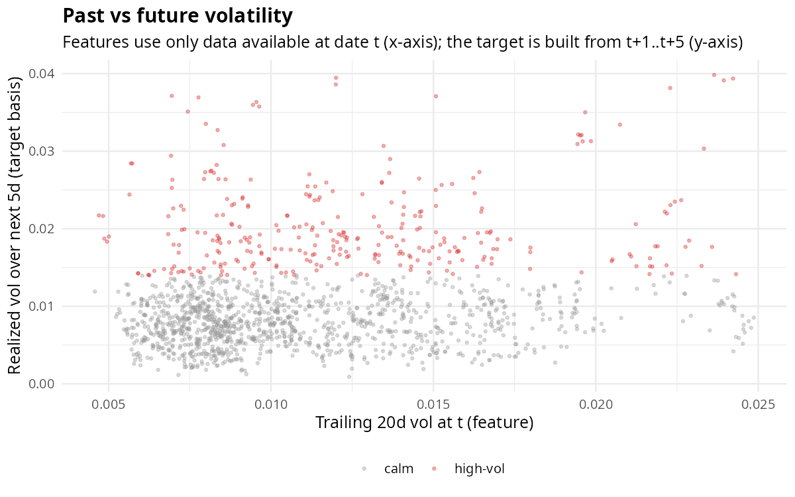
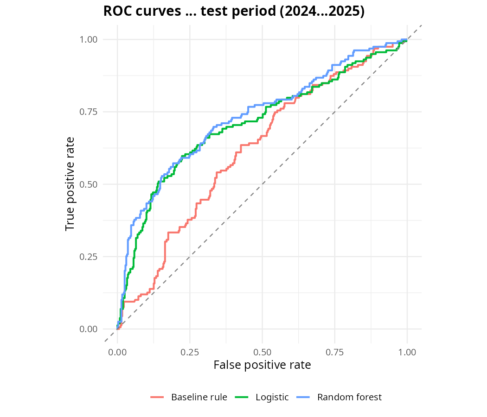
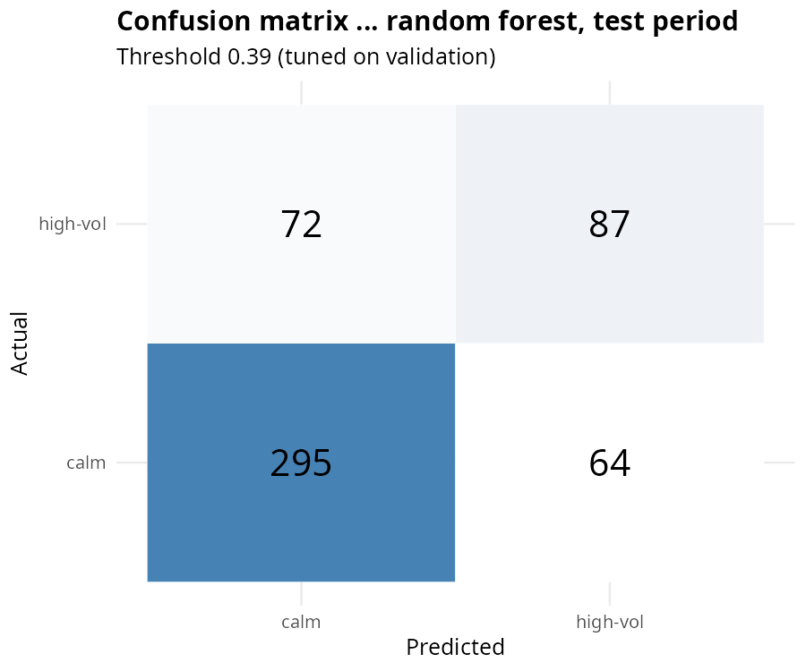
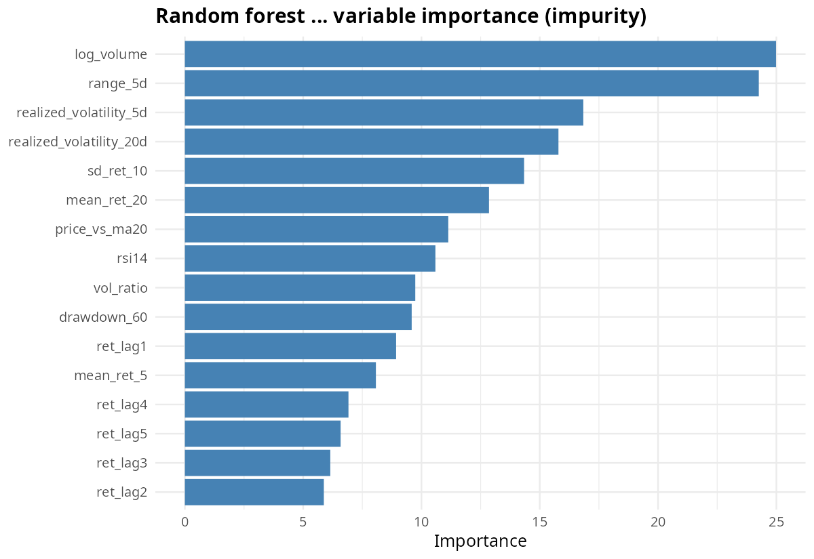
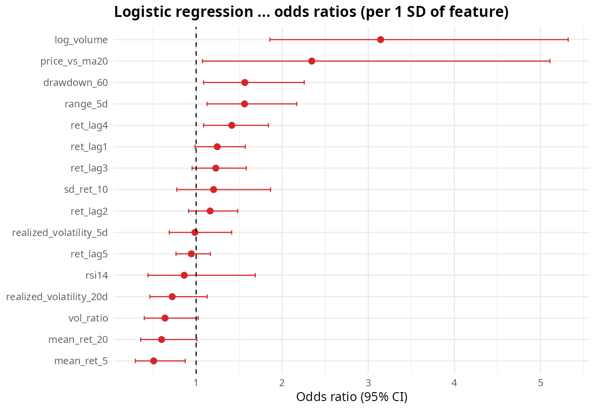
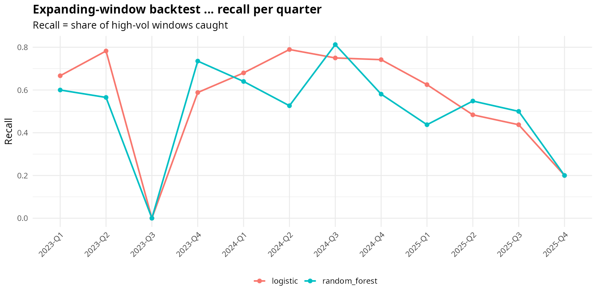

```{r setup, include=FALSE}
knitr::opts_chunk$set(echo = FALSE, warning = FALSE, message = FALSE,
                      fig.align = "center", out.width = "92%")
suppressPackageStartupMessages({library(readr); library(dplyr); library(knitr)})
metrics <- read_csv("../outputs/metrics_val_test.csv", show_col_types = FALSE)
target_def <- read_csv("../outputs/target_definition.csv", show_col_types = FALSE)
cm <- read_csv("../outputs/confusion_test.csv", show_col_types = FALSE)
bt <- read_csv("../outputs/backtest_quarterly.csv", show_col_types = FALSE)
fmt <- function(x, d = 3) format(round(x, d), nsmall = d)
```

> **Framing.** This is a market-risk *classification* exercise on synthetic data.
> It is not investment advice and not a trading recommendation.

## 1. Objective

Estimate, as of the current trading date *t*, whether the **next five trading days**
will be a high-volatility period. The use case is risk monitoring: flag windows that
deserve hedging, reduced exposure, or closer oversight — where a **missed** high-vol
window is costlier than a false alarm.

## 2. Data

`market_risk_daily.csv` — synthetic daily market series, 2020-01-02 to 2025-12-31
(1,565 trading days), single ticker `SYNTH_MKT`, with OHLC, volume, daily returns,
two trailing realized-volatility columns, and a practice label
`high_volatility_next_5d` (1 = high volatility over the next five trading days).

**Data-quality findings**

- No duplicate rows; dates strictly increasing (chronological order confirmed).
- No OHLC violations (`high ≥ max(open, close)`, `low ≤ min(open, close)`); all volumes positive.
- Missing values are structural, not corrupt: trailing-vol columns are `NA` for the
  first 4/19 rows (warm-up — a trailing window needs history), and the target is
  `NA` for the final 5 rows (the 5-day future window is unavailable).
- Target balance: 312 positives / 1,560 labelled days (**20.0%**). The positive rate
  varies by year (9.2% in 2020 up to 25.6% in 2024) — volatility regimes shift,
  which matters for stability analysis (§8).





## 3. Target definition (rigorous)

The supplied label is treated as a **practice label**. For a rigorous study the
high-volatility threshold is estimated on the **training period only**, then frozen:

- **Basis:** future realized volatility = standard deviation of daily returns over
  *t+1 … t+5*.
- **Threshold:** 75th percentile of that quantity on the training period
  (`r target_def$train_start` to `r target_def$train_end`), giving a frozen cutoff of
  **`r fmt(target_def$threshold, 6)`**.
- **Label:** 1 if future 5-day vol ≥ threshold, else 0. The identical frozen
  threshold is applied to validation and test — no peeking at later regimes.

Agreement between the rigorous target and the supplied practice label is
**`r sprintf("%.1f%%", 100 * target_def$agreement_with_supplied)`**, and the
positive rates are close (rigorous `r sprintf("%.1f%%", 100 * target_def$positive_rate_rigorous)`
vs supplied 20.0%). All modelling below uses the rigorous target.



The scatter above shows why this is a hard problem: past and future volatility are
correlated, but the classes overlap heavily — a good model must exploit subtler
signals (volume, momentum, drawdown) beyond "vol is already high".

## 4. Features and leakage discipline

Sixteen predictors, every one computable from data available **at date *t***:

- **Lagged returns:** `ret_lag1 … ret_lag5`
- **Trailing return moments:** 5/20-day mean return, 10-day return sd
- **Trailing volatility:** supplied `realized_volatility_5d/20d` — *verified* trailing
  by recomputation (max |supplied − recomputed| < 1e-9), so past-only and leakage-free
- **Volume:** log volume, volume vs 20-day average (`vol_ratio`)
- **Price structure:** 5-day mean high–low range, distance from 20-day MA,
  60-day drawdown, 14-day RSI (Wilder)

Excluded from predictors: the practice label, `future_vol_5d` (target basis),
`date`/`ticker` identifiers. Warm-up rows with incomplete trailing windows are
dropped, leaving the analysis-ready modeling table.

## 5. Validation design

Strictly chronological — no shuffling:

| Split      | Period              | Rows |
|------------|---------------------|------|
| Train      | 2020-01-02 – 2022-12-31 | ~780 |
| Validation | 2023                | ~260 |
| Test       | 2024 – 2025         | ~520 |

(Exact counts after warm-up filtering are in the metrics table below.)
The probability threshold is tuned on **validation only** (max F1). A second
stability diagnostic refits both models each quarter on an expanding window
(2023-Q1 → 2025-Q4) with frozen thresholds (§8).

## 6. Models

- **Logistic regression** — baseline; features standardized with training-period
  mean/sd.
- **Random forest** (`ranger`, 500 trees, `mtry = √p`, `min.node.size = 20`,
  probability mode).
- **Baseline rule** — predict high-vol when trailing 20-day vol exceeds its
  training-period 75th percentile (a naive "vol is already high" heuristic using
  the trailing-vol series itself as the score for ROC/PR curves).

## 7. Results

### 7.1 Metrics (validation-tuned thresholds, frozen for test)

```{r metrics-table}
metrics %>%
  mutate(across(c(threshold, precision, recall, f1, roc_auc, pr_auc),
                ~ fmt(.x))) %>%
  select(model, split, threshold, n, precision, recall, f1, roc_auc, pr_auc) %>%
  kable(caption = "Precision, recall, F1, ROC-AUC, PR-AUC. Thresholds chosen on validation only.")
```

### 7.2 ROC and precision–recall curves (test)




PR curves are the honest view under class imbalance (test positive rate 30.7%,
dashed line). One finding deserves emphasis: the naive trailing-vol rule is the
best *ranker* here (PR-AUC 0.63 vs 0.55–0.56 for the models) — volatility
persistence means the very highest trailing-vol days are very likely to stay
volatile. But as a *classifier* at its fixed operating point it is weak
(F1 0.39): the models, with validation-tuned thresholds, achieve the better
precision–recall balance (F1 ≈ 0.56) and higher ROC-AUC (0.71–0.73 vs 0.62).
In short, raw trailing volatility ranks well, while the models turn the broader
feature set into better operating-point decisions.

### 7.3 Confusion matrix — random forest, test



```{r cm-table}
cm_wide <- cm %>%
  mutate(actual = ifelse(actual == 1, "high-vol", "calm"),
         predicted = ifelse(predicted == 1, "high-vol", "calm")) %>%
  tidyr::pivot_wider(names_from = predicted, values_from = n, values_fill = 0)
kable(cm_wide, caption = "Test confusion counts by model.")
```

**Reading the errors.** False alarms (predicted high-vol, actually calm) vs misses
(actually high-vol, predicted calm): for a risk desk, misses are the expensive
error — an unflagged turbulent week. The validation-tuned threshold maximizes F1,
which balances the two; if misses must be minimized, the threshold can be lowered
at the cost of more false alarms (visible directly on the PR curve above).

### 7.4 What the models use





Trailing volatility dominates, as expected — but volume ratio, drawdown, lagged
returns and RSI all contribute, which is why both models beat the naive
trailing-vol rule.

## 8. Stability over time

```{r backtest-summary}
bt %>%
  group_by(model) %>%
  summarise(mean_F1 = fmt(mean(f1)), sd_F1 = fmt(sd(f1)),
            mean_recall = fmt(mean(recall)), .groups = "drop") %>%
  kable(caption = "Expanding-window quarterly backtest (2023-Q1 to 2025-Q4): mean ± sd.")
```




Performance is not flat: both models dip in some quarters (regime shifts — recall
the yearly positive rate ranged from 9% to 26%). The sharpest dips (2023-Q3,
2025-Q4) are unusually calm quarters — only 3/65 and 5/61 positives (5–8%,
vs ~31% across the test period) — where the frozen thresholds rarely fire and
the few high-vol windows are missed. The failure mode is thus concentrated in
calm regimes, exactly when a risk desk might relax. The random forest is
steadier than logistic regression on average (mean quarterly F1 ≈ 0.50 for
both, SD ≈ 0.24), but neither is immune to regime change — a production system
would need periodic refits and a monitoring dashboard, not a train-once model.

## 9. Limitations

- **Synthetic data.** All patterns are simulated; nothing here transfers to real markets.
- **Single series.** One synthetic index, no cross-sectional or macro features.
- **Threshold choice.** The 75th percentile is a defensible but arbitrary definition
  of "high" volatility; results move with it.
- **No costs modeled.** False alarms vs misses are discussed qualitatively; a real
  deployment needs a cost matrix from the risk desk.
- **No transaction frictions or regime features** (VIX-like, credit spreads, news).
- **Not investment advice.** This predicts volatility, not returns or direction —
  and on synthetic data at that.

## 10. Reproducibility

1. Open `financial-market-risk.Rproj` in RStudio (R ≥ 4.3).
2. Install packages: `install.packages(c("tidyverse", "lubridate", "zoo", "ranger",
   "pROC", "PRROC", "rmarkdown", "knitr", "shiny"))`.
3. Run `source("run_all.R")` — inspection → EDA → features → training →
   backtest → this report.
4. Launch the dashboard: `shiny::runApp("shiny")`.

All randomness is seeded (`set.seed(42)`); every threshold and split is defined by
date, so reruns are deterministic.

```{r session, echo=FALSE}
cat(R.version.string)
```
